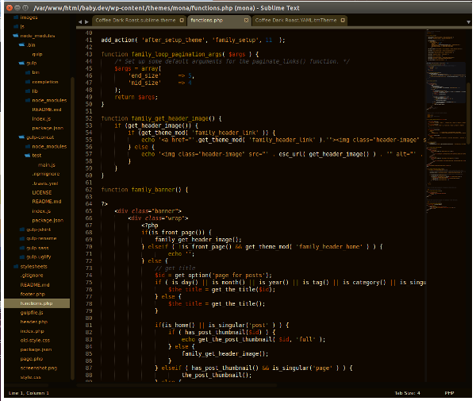

### Coffee
----------

## About
----------
Coffee is a minimalist theme and color scheme/syntax highlighting with an earthy flair for Sublime Text 2 & 3 /  Textmate. It is largely based on the wonderful theme [Flatland]("https://github.com/thinkpixellab/flatland" Flatland Theme), which is in turn based on [Soda]("https://github.com/buymeasoda/soda-theme" Soda Theme). Two great places to start if you're developing your own themes.

It is a work-in-progress as of June 17, 2014. I hope to release a fully completed version very soon.

## Dark Roast
-----------
Currently IN DEVELOPMENT is the Dark Roast version with a Light Roast to follow. Here's a preview:

